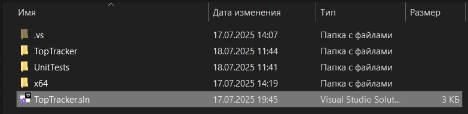
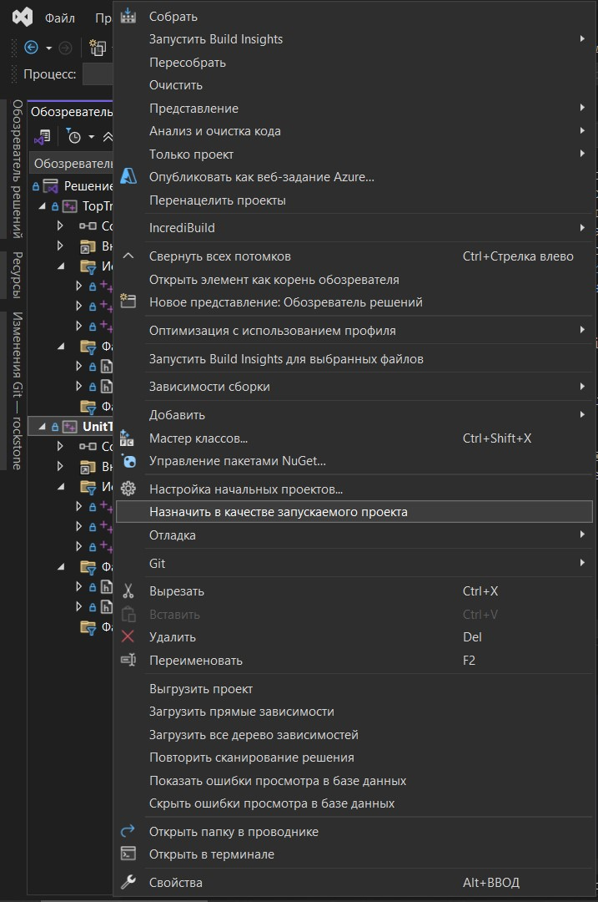
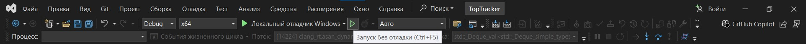
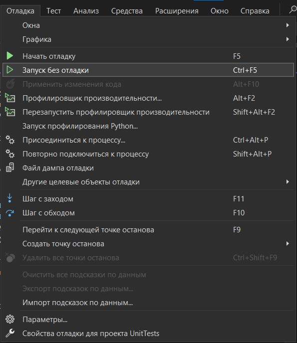
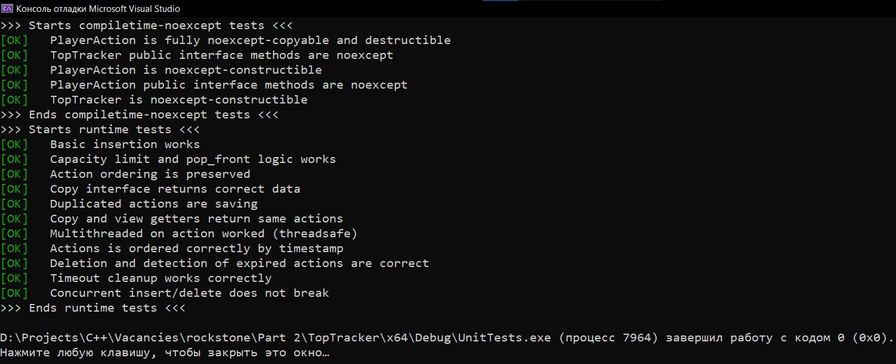

# Часть 2. Реализация функциональности
---

## Условие

**Задание:**
* Реализовать мини-модуль `TopTracker`, который хранит N последних действий игроков с привязкой ко времени.
* В модуле должны быть реализованы операции: добавление нового действия, удаление старых действий по истечении тайм-аута (очистка "просроченных" записей), и получение текущего списка сохранённых действий.
* Использовать стандартные контейнеры (например, `std::deque`, `std::unordered_map`) – необходимо объяснить выбор тех или иных структур данных.
* Минимизировать внешние зависимости – желательно использовать только стандартную библиотеку C++ и, при необходимости, Boost (например, Boost.Timer/Chrono) для работы со временем.
* Реализовать unit-тесты для разработанного модуля `TopTracker`.
* Код модуля и тестов должен быть написан в **том же стиле**, что и существующие файлы проекта (`Client.cpp/h`), включая соглашения по отступам, именованию и общей архитектуре решения.

---

## Решение

### Некоторые выводы из анализа кода первой части задания

Поскольку данная часть задания требует следования стилю программирования и архитекторному решению, показанных в первой части задании, то считаю разумным озвучить соображения и наблюдения, повлиявшие на выполнение этой части задания.

Разумеется, особых вопросов стиль кода не вызывает (snake case для методов и переменных, pascal case для названий классов, операторные скобки начинаются на новой строке, явное использование ключевого слова `this`, использование табов для оступов с размером 4 пробела и т.д.).

Общее архитектурное решение тоже понятно - максимальная модульность класса, заключающаяся в данном случае в обработке и инкапсуляции соединения игрока с сервером.

Неясным остаётся (видимо, потому что приведён не весь код класса) приватный интерфейс, который не вызывается из публичного. Очевидно, что `Client` - это callback, однако в этом случае неясно как именно используется `Client::on_packet(const server::Packet &packet)`, ведь в конструкторе нет, к примеру, инциализации потока, как-то задействующего приватный интерфейс. Тогда остаётся только то, что в приведённом участке кода отсутствует `friend` объявление метода или класса, где либо асинхронно, либо синхронно вызывается приватный метод.

Это важное допущение, которое я осознанно применил при решении данной части задачи. В частности, поэтому я отдаю предпочтение функциональным требованиям (явно определил их в публичном интерфейсе). Я предполагаю, что требуемый `TopTracker` на более высоком уровне абстракции, и что он не распарсивает пакеты. В противном случае, мне пришлось бы гадать о структуре пакета, о токенах `ClientEvent` и способе взаимодействия с сетевым протоколом. Ничего из этого не описано и не может быть явно выведено из кода первой части задания (как я это показал на примере публичного и приватного интерфейсов), поэтому, скорее всего, классы "заглушки" и мои предположения имели бы мало общего с реальностью и только бы портили семантику требуемого класса.
Это важное допущение, которое я осознанно применил при решении данной части задачи. В частности, поэтому я отдаю предпочтение функциональным требованиям (явно определил их в публичном интерфейсе). Я предполагаю, что требуемый ини-модуль `TopTracker` находится на более высоком уровне абстракции, и что он не распарсивает пакеты. В противном случае, мне пришлось бы гадать о структуре пакета, о токенах `ClientEvent` и способе взаимодействия с сетевым протоколом. Ничего из этого не описано и не может быть явно выведено из кода первой части задания (как я это показал на примере публичного и приватного интерфейсов), поэтому, скорее всего, классы "заглушки" и мои предположения имели бы мало общего с реальностью и только бы портили семантику требуемого класса.

### Интерфейс мини-модуля `TopTracker`

По нотации АТД `TopTracker` поддерживает следующие действия:
* `TopTracker(timeout, actions_max_count)` - конструктор; параметр `timeout` определяет время в секуднах, по истечении которого запись считается "просроченной"; параметр `actions_max_count` ограничивает максимальное количество хранимых записей.
* `on_action(player_id, action_type)` - добавляет новое действие в `TopTracker`; параметр `event` агрегирует как id игрока, так и тип действия. 
* `delete_old_actions()` - удаляет все сохраненные действия, у который разница текущего времени и сохраненного больше, либо равно `timeout`.
* `get_actions_view()` - возвращает текущий список сохранённых действий в виде ссылки, без копирования.
* `get_actions_copy()` - возвращает текущий список сохранённых действий в виде копии контейнера.

### Структура данных

Каждое действие агрегировано в структуру `PlayerAction`, хранящую следующие данные:
* `uint64_t player_id` - id игрока.
* `PlayerAction::Type type` - тип действия игрока.
* `std::chrono::steady_clock::time_point time_stamp` - время, когда было совершено действие. Рассчитывается автоматически при создании экземпляра класса.

Для упрощения анализа условно разделим все STL контейнеры на два типа: 
1. ordered (`vector`, `deque`, `list`, `set`, `map`, `multiset`, `multimap`) - сохраняют или формируют порядок при вставки элементов.
2. unordered (`unordered_set`, `unordered_map`, `unordered_multiset`, `unordered_multimap`) - не сохраняют и не формируют порядок при вставке элементов.

В общем случае, второй вариант предпочителен из-за использования хеш-таблиц, у которых эффективный доступ *O*(1) и вставка *Θ*(1) (правда вставка обладает *O*(n), хоть вероятность такого большего числа промахов мала). Однако они не подходят для текущей задачи, поскольку не сохраняют порядок вставки, что потребует дополнительных действий при реализации вывода списка сохранённых действий по порядку.

Рассмотрим первый вариант. Здесь можно сразу исключить:
* `list` - избыточность накладных расходов (из-за указателей для связей узлов), как следствие, низкая кеш-локальность. Невозможно эффективно применять бинарный поиск (см. ниже);
* `vector` - затруднено удаление старых элементов. Допустим, в конец вектора поступают новые (по времени) действия. Старые располагаются вначале. В результате, их удаление каждый раз будет приводить к реаллокации памяти вектора со сложностью *O*(n - k), где k - количество удалённых элементов.

Таким образом, остаются `set`/`multiset`, `map`/`multimap` и `deque`.

Внутреннее представление `set`/`multiset` и `map`/`multimap` использует дерево, которое ускоряет поиск элементов и автоматически сортирует данные. Поэтому вставка элемента имеет сложность *O*(log N). Но это излешняя функциональность при условии, что данные о действиях пользователя сохраняются по мере поступления. Поскольку `PlayerAction` сама региструет время попадания в `TopTracker`, то в случае синхронного вызова `add_action` контейнер будет всегда заполняться действиями от позднего к раннему.

Поэтому `deque` является наиболее подходящим вариантом. У этого контейнера сложность вставки вперед и удаления с конца одинакова - *O*(1). Вдобавок, поскольку массив отсортированный и поддерживает последовательные итераторы, то при нахождении конца подмножества устаревших записей можно использовать двоичный поиск.

### Тесты

| Категория     | Название теста                   | Описание                                                          | Пройдено |
| --------------| ---------------------------------| ----------------------------------------------------------------- | :------: |
| Compile-time  | `constructible_player_action`    | Проверка `noexcept`-конструктора `PlayerAction`.                  |    ✅    |
| Compile-time  | `copyable_player_action`         | Проверка `noexcept` copy/move/assign/destroy для `PlayerAction`.  |    ✅    |
| Compile-time  | `public_interface_player_action` | Проверка `noexcept` методов доступа `PlayerAction`.               |    ✅    |
| Compile-time  | `constructible_toptracker`       | Проверка `noexcept`-конструктора `TopTracker`.                    |    ✅    |
| Compile-time  | `public_interface_toptracker`    | Проверка `noexcept` всех публичных методов `TopTracker`.          |    ✅    |
| Runtime       | `basic_insertion`                | Добавление `PlayerAction` и проверка их наличия в `TopTracker`.   |    ✅    |
| Runtime       | `capacity_limit`                 | Проверка логики вытеснения при переполнении списка действий.      |    ✅    |
| Runtime       | `timeout_cleanup`                | Удаление устаревших действий.                                     |    ✅    |
| Runtime       | `action_ordering`                | Проверка сохранения порядка вставки.                              |    ✅    |
| Runtime       | `copy_interface`                 | Проверка `get_actions_copy` на корректность.                      |    ✅    |
| Runtime       | `monotonic_timestamps`           | Проверка монотонности временных меток (отсортированности).        |    ✅    |
| Runtime       | `duplicate_actions_allowed`      | Поддержка дублирующихся действий.                                 |    ✅    |
| Runtime       | `delete_old_actions_keeps_fresh` | Проверка, что новые действия не удаляются.                        |    ✅    |
| Runtime       | `get_copy_equals_view`           | Проверка эквивалентности `copy` и `view`.                         |    ✅    |
| Multithreaded | `concurrent_delete_and_insert`   | Проверка многопоточной вставки (thread-safe).                     |    ✅    |
| Multithreaded | `concurrent_delete_and_insert`   | Параллельное добавление и удаление — проверка на состояние гонки. |    ✅    |

*Все тесты выполняются асинхронно. Вывод в стандартные потоки std::clog (в случае успеха) и std::cerr (в случае провала).*

### Структура проекта

Эта часть задания выполнена в Microsoft Visual Studio 2022 для Windows 10 с использованием стандарта C++23 и компилятора MSVC. Внутри папки `TopTracker` находится решение, в котором лежат 2 проекта:
1. `TopTracker` - непосредственная реализация класса `TopTracker`. Он не предназначен для запуска (содержит просто исходники).
1. `UnitTests` - содержит тесты для класса `TopTracker`. Для его сборки необходим проект `TopTracker` (он должен находиться в той же родительской папке, что и `UnitTests`).

Оба проекта - консольные приложения. Чтобы открыть решение в Microsoft Visul Studio достаточно открыть файл `TopTracker.sln`.

По умолчанию, запускаемый проект - `UnitTests`. Его название во вкладке "Обозреватель решения" должно быть выделено жирным. Если нет, то нужно щёлкнуть ПКМ по названию проекта в "Обозреватель решения" и выбрать пункт "Назначить в качестве запускаемого проекта".

После чего достаточно нажать кнопку "Запуск без отладки" на верхней панели IDE.

Должна появиться консоль с логом тестов.

### Резюме

Требуемый мини-модуль `TopTracker` спроектирован как самостоятельный компонент, композирующий в контейнере экземпляры вспомогательного класса `PlayerAction`, также разработанного в рамках решения задания. Архитектурное решение выполнено с оглядкой на пример из первой части задания. Однако, во многом из-за неясности сути приватного интерфейса (см. ком. ранее), недостаточность сведений не позволила повторить тот же уровень абстракции без умозрительных предположений и догадок. Поэтому `TopTracker` несколько более высокоуровневый компонент, нежели `Client` из первой части задания. Он не работает с пакетами, и рассчитан на то, что другие классы используют его публичный интерфейс, передавая токены действия и id игрока. Тем не менее, он полностью отвечает функциональным требованиям из условий задания. Стиль кода такой же, что и у исходного кода `Client`.

`TopTracker` потокобезопасен (threadsafe) и масштабируем. Он максимально эффективен как по памяти, так и быстродействию. Реализованные unit-тесты покрывают большую часть вариантов использования, и подтверждают качество компонента. При конкретизации условий работы `TopTracker` (его контекста, окружения) рекомендуется продолжить тестирование, добавив интеграционные и нагрузочные тесты.